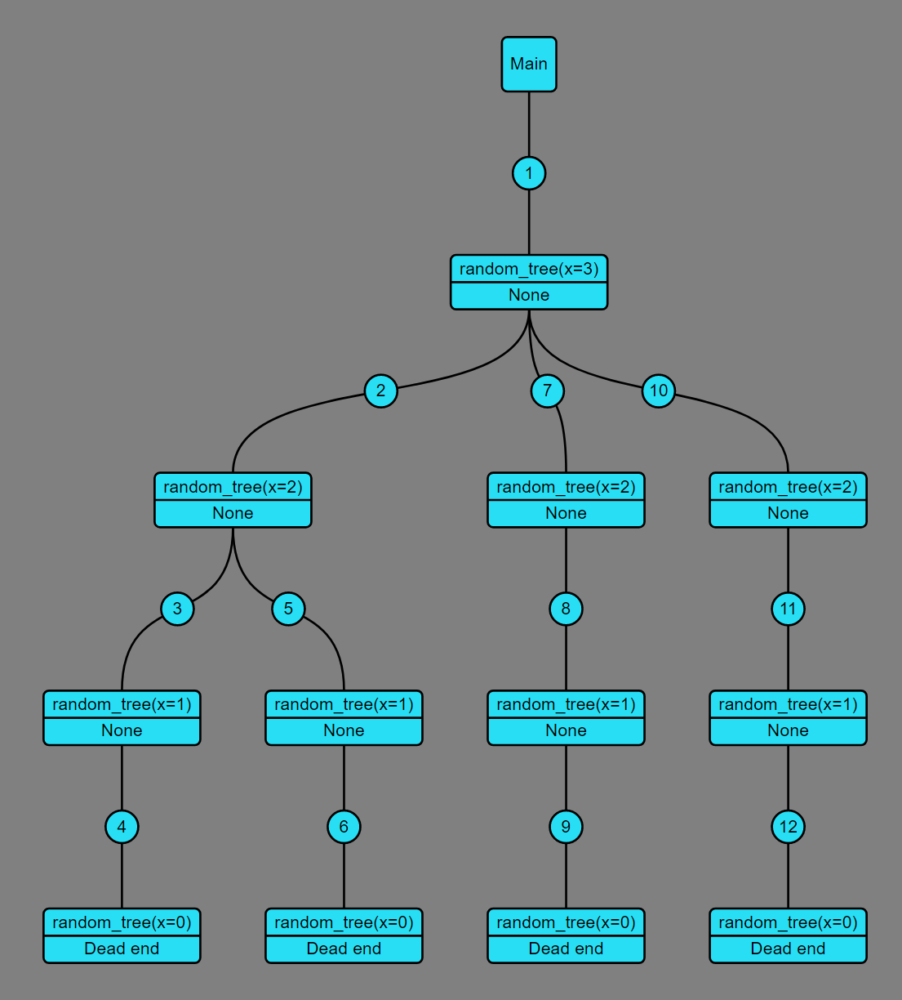
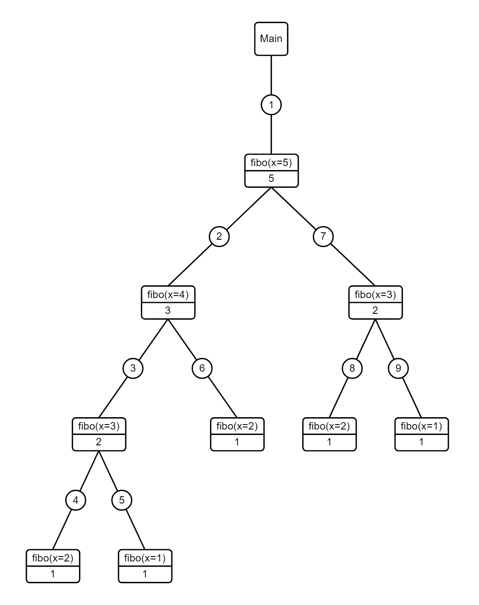
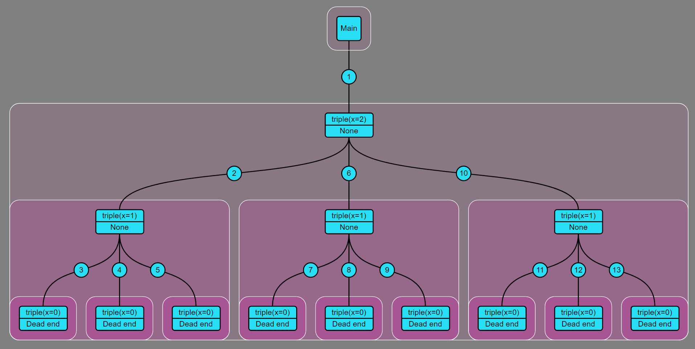

# Recursion tree

Illustrates recursive calls graphically.

## Installation

```shell
pip install recursion_tree
``` 

## Usage

Just add the 'recursion_tree' decorator to any recursive function.
The result will be automatically saved as an SVG file.
Additional settings might be achieved via settings.py 
or by passing arguments to the decorator.

```python3
import random
from recursion_tree import recursion_tree

scientific_style = {
    'draw_boundary': False,
    'color_background': 'white',
    'color_num_background': 'white',
    'color_node_body': 'white',
    'color_node_stroke': 'black',
    'color_text': 'black',
    'color_connection': 'black',
    'node_stroke_bezier': False
}


@recursion_tree(scientific_style)
def calc_fibonacci(x: int) -> int:
    """Calculate the Fibonacci sequence."""
    if x == 1 or x == 2:
        return 1

    return calc_fibonacci(x=x - 1) + calc_fibonacci(x=x - 2)


# No parameters means default settings
@recursion_tree
def random_tree(depth: int) -> str:
    """Generate random tree."""
    if depth == 0:
        return 'Dead end'

    for _ in range(random.randint(1, depth)):
        random_tree(depth=depth - 1)


if __name__ == '__main__':
    # Run out target function and save results
    calc_fibonacci(x=5)
    random_tree(x=4)
```

You could find more examples in **recursion_tree/demo.py**.

## Style setup

Default style:



Scientific style:



Default style with boundaries:


